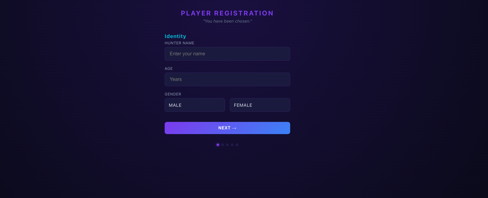

# THE SYSTEM — Solo Leveling Fitness PWA

A gamified fitness transformation app inspired by Solo Leveling. Enter your stats, receive a fully personalized RPG system with daily quests, XP, leveling, ranks, badges, weekly dungeons, and boss raids.

**"I alone level up."**

## Features

**Core System:**
- Dynamic system generation based on your body stats, fitness level, and equipment
- 6 ranks (E → S) with progressive daily quests that scale with you
- XP & leveling (100 XP per level)
- Weekly dungeons (Saturday challenges themed after Solo Leveling locations)
- Monthly boss raids (fitness tests named after Monarchs)
- 17+ badges and titles to earn
- Shadow Army — habit stacking system that grows with you
- Phased nutrition protocol (Awareness → Structure → Optimization → Mastery)
- Penalty system for missed days
- Skill tree — new exercises unlock only when you rank up

**Smart Intelligence Layer:**
- Auto-difficulty scaling — system increases/decreases reps based on your performance
- Energy check-in — daily "How do you feel?" adapts quest intensity
- Plateau detection — warns when weight stalls, suggests protocol changes
- Personal Records tracker with PR celebrations
- Predicted goal date — calculates when you'll reach target weight based on actual rate
- Weekly review with grade (S/A/B/C/D)
- Deload week auto-detection — suggests recovery every 4-5 weeks
- Rest day intelligence — forces rest after 6 consecutive workout days

**Technical:**
- PWA — installable on Android/iOS from browser (no app store)
- Works fully offline (Service Worker caching)
- Guest mode — works immediately with zero login
- Google Sign-In — optional cloud sync across devices via Firebase
- All data stored in localStorage (guest) or Firestore (signed in)
- Pure HTML/CSS/JS — no frameworks, no build step, no dependencies
- Dark theme with Solo Leveling purple/blue glow aesthetic

## Screenshots




## Quick Start

### Option 1: Use it now

**[https://arise.akeno.in](https://arise.akeno.in)**

Open the live app, register your stats, and start your first quest.

### Option 2: Self-host

```bash
git clone https://github.com/YOUR_USERNAME/solo-leveling-system.git
cd solo-leveling-system/app
python3 -m http.server 8080
# Open http://localhost:8080
```

### Option 3: Deploy your own (Firebase Hosting)

```bash
cd app

# Add your Firebase config in js/firebase-config.js
# Update .firebaserc with your project ID

firebase login
firebase deploy --only hosting
```

## Firebase Setup (for cloud sync)

1. Create a project at [Firebase Console](https://console.firebase.google.com/)
2. Enable **Authentication** → Sign-in method → **Google**
3. Create **Firestore Database** → Start in test mode
4. Register a Web app → copy config values
5. Paste config into `app/js/firebase-config.js`
6. Deploy

## Project Structure

```
solo-leveling-system/
├── app/
│   ├── index.html          # Main app shell
│   ├── manifest.json       # PWA manifest
│   ├── sw.js               # Service Worker (offline)
│   ├── firebase.json       # Firebase Hosting config
│   ├── css/
│   │   └── style.css       # Full styling (dark theme)
│   ├── js/
│   │   ├── engine.js       # Core game logic (XP, levels, ranks)
│   │   ├── quests.js       # Dynamic quest/dungeon/boss generation
│   │   ├── smart.js        # AI layer (adaptive difficulty, predictions)
│   │   ├── firebase-config.js  # Firebase credentials
│   │   ├── ui.js           # UI rendering
│   │   └── app.js          # State management, app lifecycle
│   └── icons/
│       ├── icon-192.png
│       └── icon-512.png
├── system_generator.py     # CLI version (Python)
├── SYSTEM.md               # Full system documentation
└── README.md
```

## How It Works

1. **Register** — Enter name, age, height, weight, equipment, fitness test results
2. **System generates** — Personalized quests, rank targets, nutrition protocol, boss raids
3. **Daily** — Complete your quest, earn XP, level up
4. **Weekly** — Clear the dungeon on Saturday for bonus XP
5. **Monthly** — Face the boss raid (fitness test) to rank up
6. **Smart adaptation** — System scales difficulty, detects plateaus, forces rest when needed

## Tech Stack

| Layer | Tech |
|-------|------|
| Frontend | Vanilla HTML/CSS/JS |
| Styling | CSS custom properties, gradients, animations |
| Storage (local) | localStorage |
| Storage (cloud) | Firebase Firestore |
| Auth | Firebase Auth (Google) |
| Hosting | Firebase Hosting |
| Offline | Service Worker + Cache API |
| Install | PWA manifest |

## Contributing

Fork it, make it yours. Ideas:
- Add sound effects on level-up
- Notification reminders
- Social features (leaderboard, challenges)
- Wearable integration (step count auto-sync)
- More exercise progressions
- Themed UI skins per rank

## License

MIT — do whatever you want with it.

---

*Built for hunters who refuse to stay E-Rank.*
